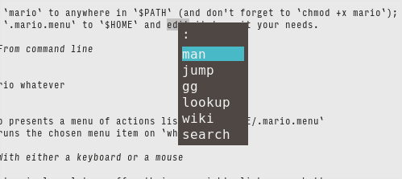

# Mario for Adding Context Menu to Kitty

## Kitty and pass_selection_to_program

Users of kitty terminal emulator can
select any text in kitty and pass that text as an argument to any program
with a keyboard shortcut in `kitty.conf`:

```
map kitty_mod+alt+w pass_selection_to_program wiki
```

I.e. hitting `kitty_mod+alt+w` keyboard shortcut invokes `wiki` shown below
 with the selected text as argument:

```
#!/bin/sh
sr -t wikipedia "$@";;
```

`wiki` displays wikipedia entry about the selected data (using surfraw(1), `sr`).

However this usage pattern demands users to create and to memorize
more keyboard shortcuts for different programs to take advantage of
kitty's `pass_selection_to_program` feature.

## Adding Context Menu to Kitty with Mario



Mario extends kitty's `pass_selection_to_program` feature:

- user selects text with a left-click
- user can hit either 'appliction menu' key on keyboard or click on a thumb button
  of the mouse to get a menu of programs
- user makes a choice from the menu (with either mouse or keyboard)
- the chosen program runs on the selected text

### Installation Prerequisites

- Install [rofi menu system](https://sw.kovidgoyal.net/kitty/index.html)
- Install [xbindkeys to map mouse buttons to a keyboard key](https://www.nongnu.org/xbindkeys/)
- Copy `mario` to anywhere in `$PATH` (and don't forget to `chmod +x mario`);
- Copy `.mario.menu` to `$HOME` and edit it to suit your needs. 
- Configure `xbindkeys` and kitty. In this example we use 'application menu'
  to invoke the menu:

*xbindkeys*:
```
"xvkbd -text '\[Menu]'"
    m:0x0 + b:9   (mouse)
"xvkbd -text '\[Menu]'"
    m:0x0 + b:8   (mouse)
```

*kitty*:
```
# application menu showkey -a: ^[[29~ glfw key:348 native_code:0xff67
map 0xff67 pass_selection_to_program mario
```

#### Notes

- Add `xbindkeys` to initialization file of desktop session.
- Change 'application Menu' and thumb buttons (8/9) of mouse to something else
  as you see fit.

#### Integrating with Mario

`mario` sets an environment variable `MARIO` when it runs the chosen menu item.
For example, `wiki` can be rewritten as

```
#!/bin/sh
case "$MARIO" in
mario) kitty @ launch --no-response sr -t wikipedia "$@";;
*)                                  sr -t wikipedia "$@";;
esac
```

`wiki` opens a new window and displays result there when it is run from `mario`
i.e. `MARIO` is set to `mario`. When `wiki` is run from a usual kitty window,
it displays the result in the window. 

#### Look and Feel of the Menu

See rofi's documentation for more details.
